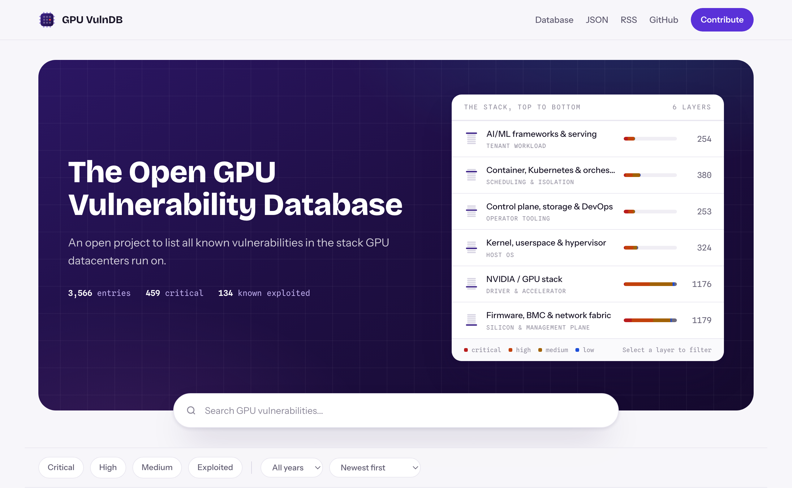
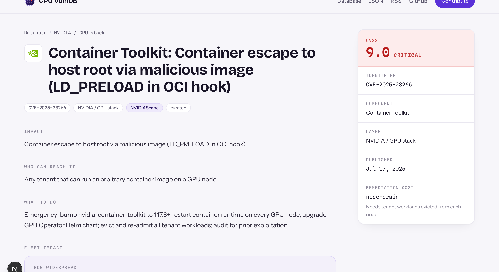

<div align="center">


# The Open GPU Vulnerability Database

**Every known vulnerability in the stack GPU datacenters run on - firmware to model serving.**

[](https://gpuvulndb.org)

[](https://github.com/liranmarkin/gpu-vulndb/actions/workflows/validate.yml)
[](LICENSE-DATA)
[](LICENSE)
[](CONTRIBUTING.md)

[**Browse the database**](https://gpuvulndb.org) · [JSON](https://gpuvulndb.org/data.json) · [RSS](https://gpuvulndb.org/feed.xml) · [Contribute](CONTRIBUTING.md)

<a href="https://gpuvulndb.org">
  
</a>

</div>

## 🎯 Why this exists

There is no shortage of vulnerability databases. There is a specific and checkable gap in them:

- **Package-centric databases cannot represent this hardware.** The [OSV schema](https://ossf.github.io/osv-schema/) keys every record to a package in a registry or distro. There is no ecosystem for firmware, BMC images, BIOS, or a GPU driver shipped as a `.run` installer, and no way to add one without changing the spec.
- **NVD tells you a score, not what to do.** A CVSS vector does not tell an operator whether the fix is a config change, a daemon restart, draining every GPU node, or flashing firmware across a fleet. For this stack, that difference is the entire cost of the fix.
- **You cannot find this hardware by searching for it.** The Linux kernel CVE corpus records which *source files* a vulnerability affects. NVD does not carry that field, so NVD can only be searched by text — and for this stack the text does not name the hardware. See below.
- **Cloud security databases cover the provider's services, not the substrate.** Cross-tenant issues in hyperscaler services get catalogued, and the provider fixes them for you. Here, *you are the provider*. Nobody patches it for you.


### What text search costs you

Measured against `vulns.git` at commit `dc9e43dc` (2026-08-20), scoping to kernel CVE records whose
`programFiles` sit under `drivers/infiniband`, `drivers/nvme/`, `drivers/net/ethernet/mellanox`,
`net/smc` or `net/rds`:

| | Records |
| --- | ---: |
| Affect those paths | **592** |
| Findable by searching Mellanox / InfiniBand / NVIDIA / ConnectX | 58 (9.8%) |
| Findable once quoted crash-trace paths are discounted | 25 (4.2%) |
| Findable by an expert who already knows the subsystem names | 438 (74.0%) |

Even the expert search misses a quarter. Only filtering on affected source path finds all 592.

The passthrough boundary is worse. Measuring the same way — does the description mention
`NVIDIA`, `AMD`, `Intel`, `Mellanox` or `ConnectX` anywhere — across the paths that implement
device assignment and fabric encryption:

| prefix | records | mention a vendor |
| --- | ---: | ---: |
| `drivers/pci` | 88 | 2 (2.3%) |
| `drivers/vfio` | 34 | 1 (2.9%) |
| `net/tls` | 34 | 0 |
| `net/xfrm` | 60 | 0 |
| `virt/kvm` | 20 | 1 (5.0%) |
| `arch/x86/kvm` | 109 | 10 (9.2%) |

Those 156 records in `pci`, `vfio` and `tls` describe the exact mechanism a GPU cloud's isolation
claim rests on — *your tenant gets the whole card and cannot touch anyone else's* — and a
vendor-name search returns essentially nothing.

One honest caveat, because it cuts the other way: `drivers/iommu` (25.4%) and `drivers/gpu/drm`
(26.6%) look far more discoverable, but that is a naming artifact. The drivers are literally called
`intel-iommu` and `amdgpu`. An operator searching "NVIDIA" still finds none of them.

The sharpest version needs no qualifier: of the **176** kernel CVEs whose affected files live under
`drivers/net/ethernet/mellanox`, only **19** mention "Mellanox" anywhere in their description, and
**none** mention "ConnectX". An operator asking "what affects my Mellanox NICs?" is searching a
field the answer was never written in.

So every entry here carries three fields a CVE record does not: **what an attacker actually gets**, **who has to be able to reach it**, and **what the operator has to do about it**.

<div align="center">
  <a href="https://gpuvulndb.org/vuln/CVE-2025-23266">
    
  </a>
</div>

It is built for the people who operate this stack: GPU clouds, colocation datacenters, HPC centers, and enterprises running their own accelerator fleets.

## 🧱 What's in scope

**4,851 entries covering 4,742 distinct CVEs, spanning 2010 to 2026** - organized by the six layers of the stack, top to bottom:

| Layer | What it covers | Entries |
| --- | --- | ---: |
| `ai-serving` | Inference servers, training frameworks, model formats | 362 |
| `container-orchestration` | Container runtimes, Kubernetes, schedulers, service mesh | 497 |
| `control-plane` | Cluster management, storage, CI/CD, observability | 839 |
| `kernel-hypervisor` | Host kernel, userspace, virtualization, microcode | 861 |
| `gpu-stack` | GPU drivers, firmware, CUDA, container toolkit, vGPU, ROCm, Gaudi | 1,191 |
| `firmware-bmc-fabric` | BMC/IPMI/Redfish, BIOS/UEFI, NVLink, InfiniBand, DPUs, PDUs, cooling | 1,101 |

**Design-level weaknesses that will never get a CVE are in scope too.** Unauthenticated IPMI over LAN, RDMA fabrics with no cryptographic binding between a packet and its connection, physical DRAM interposers that both Intel and AMD classify as out of scope - these carry an `NCVD-` id. There are 187 of them, and they are frequently a bigger problem than anything with a CVSS score. They also cannot be represented in NVD, OSV, or any advisory-passthrough database, which is a large part of why this one exists.

Out of scope: vulnerabilities with no plausible path to GPU infrastructure, undisclosed issues (this is not a disclosure venue), and anything you cannot back with a public reference.

## 💸 Cost to remediate

The field that makes this more than an advisory mirror. A CVSS score tells you how bad a vulnerability is; it does not tell you whether fixing it costs a config change or a firmware flash across every node you own. 3,409 entries carry a `fleet.pain_class`, from cheapest to most disruptive:

| Class | Entries | What it means |
| --- | ---: | --- |
| `hot-patch` | 79 | Fixable without interrupting workloads |
| `daemon-restart` | 492 | Service restart on affected nodes |
| `node-drain` | 191 | Tenant workloads evicted from each node |
| `node-reboot` | 1,891 | Full reboot of each affected node |
| `microcode + reboot` | 54 | Microcode update and a reboot |
| `firmware-flash` | 570 | Firmware flash, usually with the node out of service |
| `physical access` | 2 | Someone has to be at the machine |
| `unpatchable / mitigate-only` | 126 | **No vendor fix exists** |

These are extracted from remediation prose that names the action, never guessed. Where a remediation does not state a cost, the field is left unset rather than inferred.

## 🏷️ Entry status

Every entry declares how much human verification it has had, so the database can ship broad coverage without pretending all of it is hand-checked:

- 🤖 **`curated`** - imported from vendor advisories, NVD, and CISA KEV with machine assistance, then annotated for operators. Not individually verified against primary sources. The seed corpus is all at this tier.
- ✅ **`reviewed`** - a maintainer confirmed every field against primary sources and signed it with their GitHub handle.
- 🌱 **`stub`** - references only, no analysis yet. A good first contribution.

Always confirm against your vendor's advisory before acting on an entry.

### How new entries arrive

A scheduled sweep runs once a day: it pulls every CVE whose NVD record changed in the last few
days, filters on the vocabulary of this stack, and hands what survives to a model that makes the
scope call and drafts the operator-facing fields. Everything it produces lands at `curated` and
is committed only if `scripts/validate.py` passes. It is a coverage mechanism, not a review one -
which is exactly why verifying a `curated` entry is the most useful thing you can contribute.
The whole path is in `scripts/daily_update.sh`; nothing about it is private to the maintainers.

Publishing does not stop at the commit. The same run stamps every entry with the date it last
changed here (`scripts/seo_dates.py` → `web/data/entry-updated.json`), which is what the sitemap
reports as `lastmod` and what an entry page reports as `dateModified` - the NVD publication date
answers a different question, and a quarter of the corpus has no NVD date at all. Once Vercel has the new pages
live, `scripts/seo_ping.py` submits the changed URLs over [IndexNow](https://www.indexnow.org/),
so Bing, Yandex, Seznam and Naver hear about an entry the day it lands instead of whenever they
next choose to recrawl. Google does not take pushes; for Google the honest `lastmod` and the
[RSS feed](https://gpuvulndb.org/feed.xml) are the signal.

## ⚡ Using the data

Entries are one JSON file each, at `entries/<year>/<id>.json`. The filename is always the id. There is no build artifact to trust and no API to depend on - clone the repo:

```bash
git clone https://github.com/liranmarkin/gpu-vulndb
jq -r 'select(.kev and .layer=="gpu-stack") | .id + "  " + .title' entries/*/*.json
```

Or take it from the website:

| Endpoint | What you get |
| --- | --- |
| [`gpuvulndb.org/data.json`](https://gpuvulndb.org/data.json) | The whole corpus in one file, CORS-open |
| [`gpuvulndb.org/feed.xml`](https://gpuvulndb.org/feed.xml) | RSS feed of the newest entries |

## 🗺️ Repository layout

```
entries/<year>/<id>.json   the database - one file per entry, the source of truth
schema/entry.schema.json   the schema, enforced in CI
scripts/validate.py        what CI runs; run it before opening a pull request
scripts/ingest.py          merges researched batches into entries/, idempotent
scripts/derive_pain.py     extracts remediation cost from prose that states it
scripts/fetch_nvd_dates.py joins NVD published dates into web/data/nvd-dates.json
scripts/fetch_vendor_icons.mjs downloads vendor favicons for the site
scripts/seo_dates.py       stamps each entry with when it last changed, for <lastmod>
scripts/seo_ping.py        submits changed URLs to IndexNow once the deploy is live
scripts/daily_update.sh    the daily sweep: fetch, triage, ingest, validate, commit
scripts/consolidate.py     folds CVEs that are one issue into one entry, model-adjudicated, announce
web/                       the website (Next.js 16, React 19, Tailwind 4)
```

The site reads `entries/` straight off disk at build time, so nothing generated is ever committed and the data has no toolchain of its own. Contributing an entry needs a text editor and Python; only working on the site itself needs Node:

```bash
cd web && npm install && npm run dev
```

## 🤝 Contributing

**Every contribution matters, and most don't require writing anything new.** The single most useful thing you can do is review an existing entry against its primary sources:

| I want to... | Where to start | Effort |
| --- | --- | --- |
| ✏️ Report a wrong entry | [Open a correction](https://github.com/liranmarkin/gpu-vulndb/issues/new?template=correction.yml) | 2 minutes |
| ✅ Verify a `curated` entry | Pick one in an area you know, check every field, set it `reviewed` | 30 minutes |
| ➕ Add a missing vulnerability | [Suggest it](https://github.com/liranmarkin/gpu-vulndb/issues/new?template=new-entry.yml) or send a PR | 1 hour |
| 🔧 Improve remediation guidance | You rolled the fix across a real fleet? Tell us what it actually took | 15 minutes |

The full guide, including the entry format and the rules, is in [CONTRIBUTING.md](CONTRIBUTING.md). Every pull request is validated in CI; if this passes locally, it passes in CI:

```bash
python3 -m venv .venv && .venv/bin/pip install jsonschema
.venv/bin/python scripts/validate.py
```

## 📜 License

Data in `entries/` and `schema/` is [CC BY 4.0](LICENSE-DATA). Tooling in `scripts/` and the site in `web/` is [MIT](LICENSE). Attribution to the GPU Vulnerability Database is required when you redistribute the data.

This database is informational and carries no warranty of completeness or accuracy.

---

<div align="center">

Made with ❤️ by [Liran Markin](https://liranmarkin.com) · Contact: [contact@gpuvulndb.org](mailto:contact@gpuvulndb.org)

</div>
